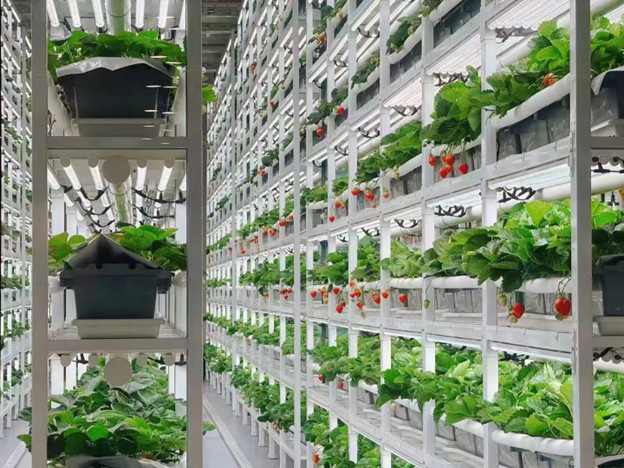

# Harvesting Robot

## Introduction
This is a research project undertaken at the University of Auckland CARES robotics laboratory during the academic year in 2026.

The current research aims are to develop a robotic system for autonomous crop harvesting in narrow environments - think indoor/vertical farms, with many layers of shelves, with narrow corridors between them. See Figure 1 to illustrate this. Crops grown in these environments include leafy greens, herbs, and fruits. The current prototype is designed specifically for strawberry harvesting, although its functionality could be extended for other products as well.



**Figure 1: Vertical farm for strawberries**

In order to navigate these environments, a gantry system will be used with extendable rails, capable of translating the manipulator/end-effector across a 2D plane (the corridor in between shelves). The manipulator itself can move within a 2D plane, covering one of the dimensions that the gantry system alone cannot access, allowing this system to harvest crops in 3 dimensions. A crop-harvesting solution like this is proposed, rather than a typical mobile autonomous robot, as it is thought to be viable for different sized indoor farm environments. This solution to this problem is largely unexplored, as vertical farming is a relatively new technological development.

<p align="center">
  
  
</p>

## Prerequisites
- Ubuntu 22.04
- Python 3.10.12
- Dynamixel SDK 4.0.5 (https://github.com/ROBOTIS-GIT/DynamixelSDK, tag `4.0.5`)
- C++ compiler with C++17 support (tested with g++ 11.4.0)
- CMake >= 3.10 (tested with 3.22.1)
- Intel RealSense SDK (librealsense2) 2.58.3
- OpenCV 4.11.0, built from source and installed such that `OpenCV_DIR=/usr/local/lib/cmake/opencv4` 

## Usage
From the repo root, build the project:

```bash
mkdir build && cd build
cmake ..
make -j$(nproc)
```

Then, from the `build` directory:

```bash
./arm_control
```

Runs the main continuous control loop, tracking and picking strawberries detected via the YOLOv5 pipeline.

Fault injection (servo torque/current too high, hardware disconnections, and similar fault conditions) is done live via the GUI rather than a CLI mode — see `./run.sh` from the repo root, which launches `arm_control` and `gui/gui.py` together.

## Directory Structure

<pre>
harvesting-robot
├── src/                 # arm control, camera, main entry point
├── safety/              # fault monitor, fault injector, IK verification
├── machine_learning/    # YOLOv5 install, model training, model output (ONNX export)
├── camera_calibration/  # scripts to calibrate the Intel RealSense camera
├── docs/                # pictures/gifs for the readme
└── README.md
</pre>